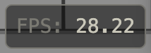
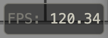
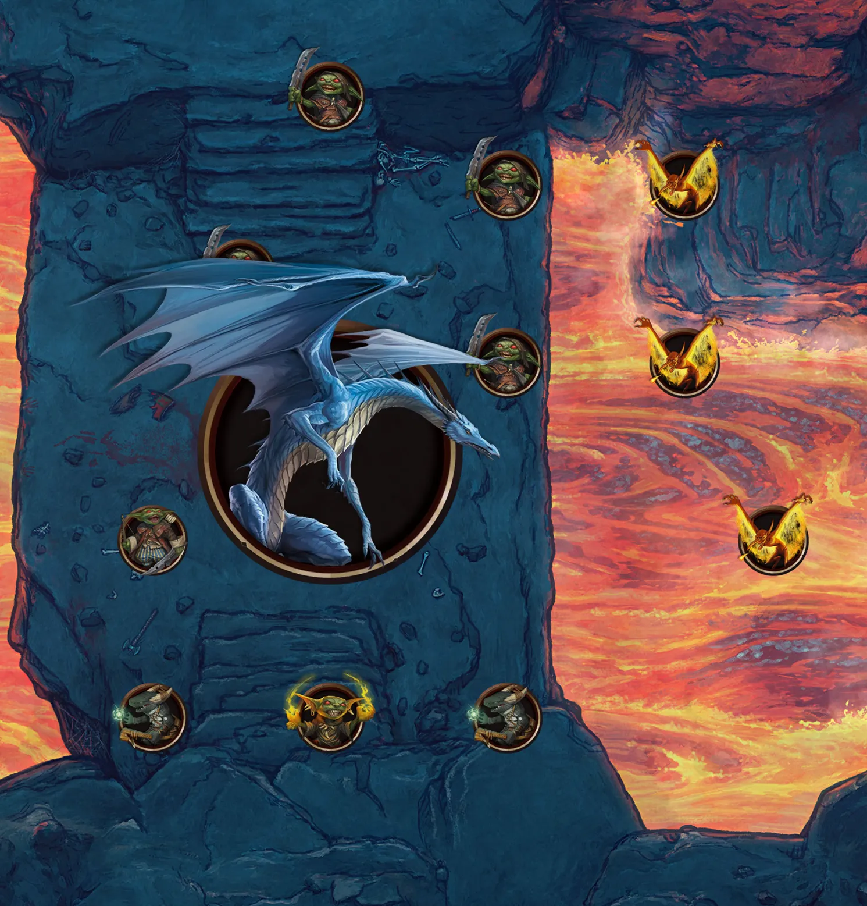
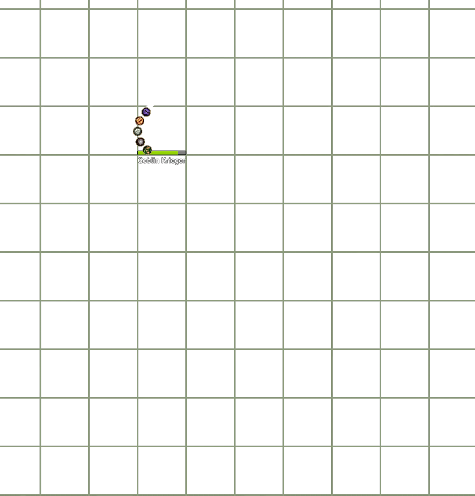
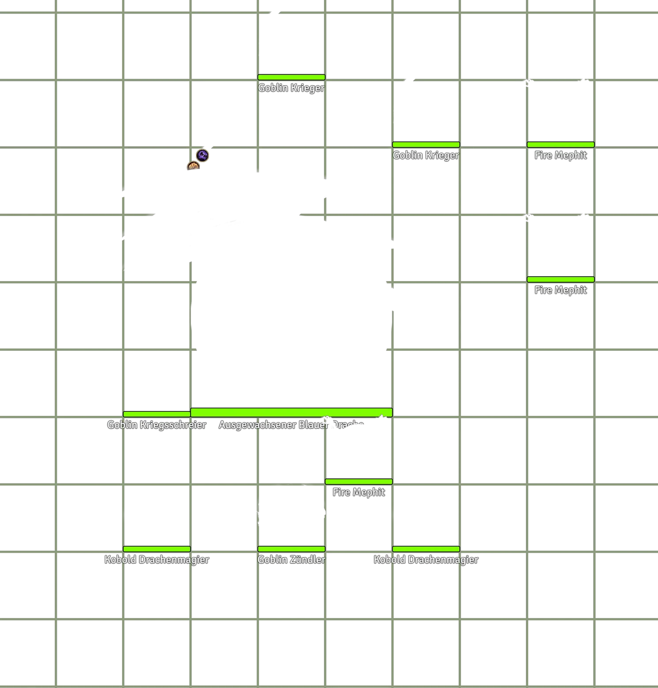
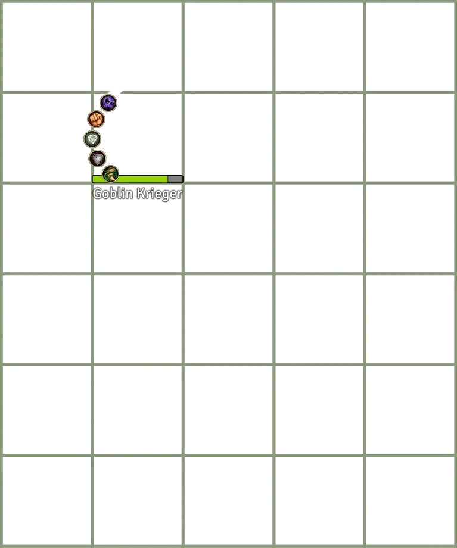
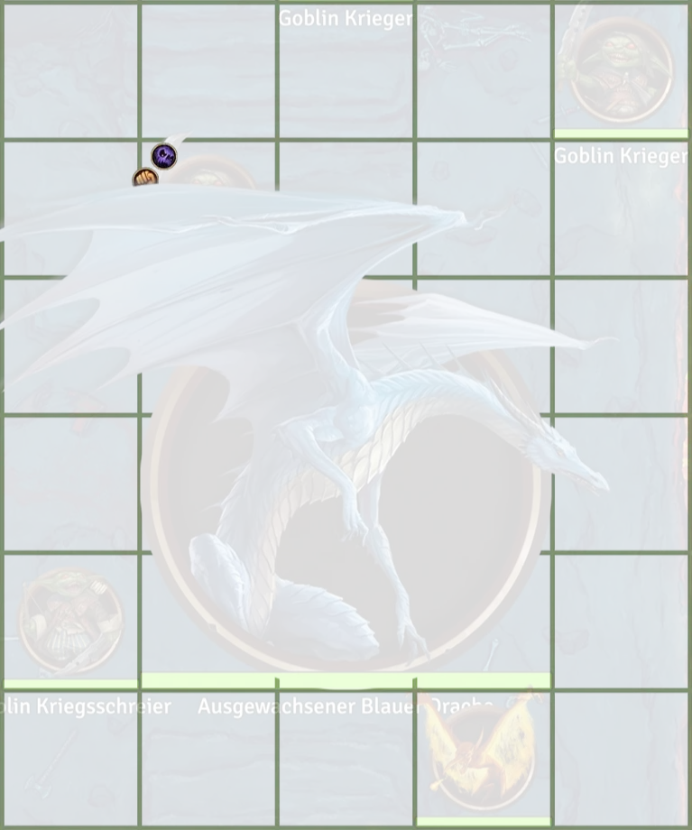

# Foundry VTT Prime Performance

Increases your Foundry VTT Performance by your favorite prime number![^1][^2] Without impact on the visual fidelity[^3]

Going from\
\
to\
 

In certain scenes with many tokens with resource bars, status effects etc visible.

[^1]: If you favorite prime number is one of 2, 3, 5 or somewhere inbetween

[^2]: Greatest speedup in scenes with many tokens, resource bars and status effects

[^3]: HP bars and status effects might look a bit blurry on lowest foundry performance settings.

## DISCLAIMER

This should be save and has been tested to the best of my ability. BUT foundry might just switch around stuff in future updates that makes these hacks obsolete (which would be the best case) or just breaks the module.

Please use this module on your own risk and if you notice visual glitches (names, resource bars not working or other token-related stuff) please let me know so I can fix the issues :)

This module does not persist any data except for settings, so a simple reload with the module disabled should revert everything back to normal.

## Expected performance gains

The exact value or increase in performance is very difficult to estimate! All it really does is greatly reduce or even elimate the overhead each token has on the performance in a scene. With >20 tokens, each wich certain effect, nameplates visible etc, the improvement might very well be a doubling in framerate. In other very complex scenes with only 4-5 tokens and without token UI elements visible, the performance improvement might not even be noticable.

My observation so far was: Performance improved (soometimes greatly) where needed and was good enough anyway otherwise.

## Settings

This module provides some individual settings to activate certain hacks that aim to improve performance by optimizing the token drawing pipeline in Foundry.

---

**Optimize Token UI Render Batching**\
Optimizes how token UI elements are erased by overlapping token images.
Gives the highest performance gains in most scenarios when only few token names or hp bars are shown.

**Cache token nameplates**\
Caches token nameplates to textures, allowing for better batching of the UI elements.

**Cache token resource bars**\
Caches token resource bars to textures, allowing for better batching of the UI elements. This can result in slightly blockier hp bars in very high zoom levels.

**Texture Replacement with Spritesheets**\
Replaces build in SVG icon rendering with a sprite atlas. Greatly reduces the amount of textures needed to render scenes, especially those with large amount of notes, different door states etc. Also introduces a sprite based replacement for control icon backgrounds to allow for more batching when rendering the interface layer.

**Custom Spritesheets**\
Allows for the replacement of arbitrary textures referenced in foundry with optimized spritesheets. To create your own spritesheets to replace build-in textures, simply name the spritesheet frames like the asset path referenced in foundry, prefixed by a `#` sign. For example, if a tile in your scene references a texture in `assets/tiles/my-fancy-tile.webp`, the spritesheet frame should be named `#assets/tiles/my-fancy-tile.webp`.

**Optimize animated lights**\
Patches the shader of certain animated lights that use fbm (fractal brownian motion) noise to use precomputed noise textures where possible. This requires each client to load a few additional textures with associated memory overhead, but in my testing this is absolytely worth it.\
Only of of the textures is actually saved in a GPU compressible format as it caused extremely blocky animations otherweise. If anyone as some ideas as to why this is, please create an issue or contact me on discord. :)

If you create custom spritesheets, it is strongly recommended to use GPU compressible textures. Supported formats are basis_universal files (`.basis`) with ETC1 texture compression and zstandard supercompression for Foundry VTT v12 and `.ktx2` files with either ETC1 or UASTC texture format and zstandard supercompression for Foundry VTT v13.
[TexturePacker](https://www.codeandweb.com/texturepacker) can be used to quickly create spritesheets and has built-in support for `.basis` files with ETC1 compression.

The best use case for this currently is to create spritesheet textures for party actors. If you are also using dynamic tokens, don't forget to also enable **Dynamic Token Spritesheet Support**. Regular token graphics _should_ use premultiplied alpha (and setting the `'alpha_mode'` property in the spritesheet meta data object to `'pma'`). For token subject images premultiplied alpha is **required**.

Future version of Prime Performance will likely contain a feature to create these spritesheets automatically and on a per-scene basis to optimize rendering in complex scenes with many tiles.

**Dynamic Token Spritesheet Support**\
Patches the dynamic token ring rendering engine to support spritesheets for the token subjects. This should only be used if you also use **Custom Spritesheets** to replace token images.

---

All Settings are considered save and activated by default. If only very few names or resource bars are shown by default (only on hover for example for every token), the caching of token nameplates and resource bars can be disabled.

This module is currently expected to be used with Dorako UX's "adjust token effect hud" setting which includes some performance optimizations. A dedicated setting for the default foundry effect textures might come in the future.

## Did you notice any other performance issues in foundry?

Please let me know when you experience performance issues. This whole project started because someone noticed performance issues with the "Adjust token effect HUD" setting of Dorako UX.

For anyone who wants to learn more about the technical details of how foundry renders token and how these measures improve the performance, feel free to read on.

## Observed Performance Issues in Foundry VTT

Foundry VTT has grown quite complex over the years!
Its elevation handling, lighting, the new dynamic token rings etc.
are great and I am still in awe at what Foundry VTT can handle.
Especially the recent V12 update has brought with it numerous
improvements to general canvas performance, elevation and token order handling,
interface layer occlusion and so on.

However, I also think that the performance in scenes, especially with multiple tokens
has somewhat regressed, mainly because of how token occlusion is now handled.

### How Tokens are rendered in Foundry

This is the frame we want to draw:

_Battlemap by [Lone Mapper](https://www.patreon.com/lonemapper)_

All in all, the background and lighting takes about 36 "Draw calls" to complete, while the token UI alone takes 45 more. There is not much we can do about the background drawing, but 45 calls for the UI layer seems exessive. And worse, each token adds 3-5 extra calls! That makes large scenes and battles especially demanding to draw. I'll skip over the nerdy details on how a frame is drawn, but needless to say, there is something we can do to improve it.

  
Wait a minute, show me the nerdy details!

To do something as simple as rendering a token, Foundry uses WebGL and there are quite a few layers to it. Lets focus on the important parts:

First, the background, token icons, darkness layer and more is Drawn. This is actually done very efficiently and only takes 11 draw calls in webgl. Draw calls are essentially the point in a frame where the CPU transfers data to the GPU along with instruction on how to draw it. Then the CPU waits for the GPU to finish and after the frame has been drawn, the programm continues. Each draw call has a fixed overhead and is one of the more expensive operations in drawing in WebGL.

After the initial layers have been drawn, the frame looks like this:

Almost done it seems! Next, lighting layer and effects are drawn and composited with the previous image. This takes another 26 draw calls. Considering 15 animated lights and 57 walls, this is not too bad.
After lighting, the frame looks like this (note the lighting/bloom effects in the lava):

Only the grid and token interface UI (names, hp bars and status effects left)!
Considering every token and the background layer was initially drawn to the canvas in just one call, how long can this take?
It turns out,

8 Calls for the grid, which I don't exactly know why, but then its on to the tokens. And each token in foundry takes about 5 draw calls to complete if nameplates, hp bars and status icons are shown! All in all, just the token UI takes about 45 calls to complete. Lets count the steps for one token:

Preparation: Create a new transparent image to draw everything, then lets look at the poor Kobold in the top left that is behind the dragons wing:

1. Clear the canvas below the token image. Why will become clear very soon. Since switching from painting to clearing breaks batching, this takes one call
1. Paint HP Bars
1. Paint Token Status Effect Background and borders
1. Paint Status Effect Icons
1. Paint Nameplates
   Depending on the situation, some but not all of these calls can be combined, but The clear + 2-3 more calls are common.

Done it looks like this:

Why the canvas is erased becomes clear when the next token, the dragon is drawn: We want to clear the ui behind the dragons wing!

and the complete UI, which is then "just" set atop the background layer.

### The problem

It turns out, the main bottleneck is an erase step in which after a token UI is drawn, parts of it can be erased by an overlapping token. For example, the kobold UI in the top left is almost completely covered by the dragon wing. For this to be possible, Foundry VTT clears the region behind a tokens graphic before its interface is drawn. So the process is:
**For every token:**

1. Draw token selection border if selected
2. erase everything that has previously been drawn that is behind the current tokens image
3. draw other UI elements.

The result after the goblin and dragon have been drawn then looks something like this:

Next, UI is cleared behind the dragon token. Final image is overlayed to make the clearing more visible:

Switching from drawing to erasing sadly always breaks batching, meaning that a new call to the GPU to erase part of the image has to be made. In a perfect world, drawing all token UI elements for all tokens would just be 1-2 calls to the GPU in total, whereas it is curerntly 2-5 GPU calls per token. this is a major bottleneck in rendering and incurs additional load to both CPU and GPU.

### The solution

Instead of this loop of drawing UI elements, clearing something behind the token, drawing more ui elements, ... we can in certain cases reorder the operations and make use of batching!

#### Batching draw operations

The calls to erase and draw ui elements normally are done in sequence, per token and looks roughly like this:

1. Erase behind Token 1 (new call)
1. Draw Token 1 UI (new call)
1. Erase behind Token 2 (new call)
1. Draw Token 2 UI (new call)
1. Erase behind Token 3 (new call)
1. Draw Token 3 UI (new call)
1. etc ...

In caess where token UI elements are not covered by other tokens however, we can simply do this:

1. Erase behind Token 1 (new call)
1. Erase behind Token 2
1. Erase behind Token 3
1. etc ...
1. Draw Token 1 UI (new call)
1. Draw Token 2 UI
1. Draw Token 3 UI
1. etc ...

Lets say drawing the token UI takes just two calls in total for: erase behind token, UI. This reordering changes the amount of total GPU calls needed from the Number of tokens \* 2 to simply 2, as no more switching between erasing and painting per token is needed.

However, the world is not perfect and sometimes tokens overlap. If we just batch all these calls, token UI elements of tokens that are covered by other tokens would suddenly appear over each other again. No good!
To remidy this, break the batch at the point in the token rendering order where we detect overlap and start another batch.

This means that in the case that every token overlaps every other token, we have gained nothing. But in the common case where we have a few overlapping tokens and many that are completely separated, we could arrive at 4-6 GPU calls for 20+ tokens instead of 40-60!

But now we face another problem: Drawing the hp bars and token effect isons also break the pipeline since we switch from drawing simple complex graphics to simple textures to graphics again. To make matters worse, every token effect icon has its own, separate texture which can someteimes be too much to batch in one go.

#### Simple bitmap caching for token effects and resource bars

Luckily, enabling caching for resource bars and effect icons is as simple as telling the graphics library foundry uses to enable caching. This just means that whenever one of the resources (HP, legendary actions, ...) of a token changes, we redraw the UI element once and then write this result to a texture. In later draw operations, no complicated graphics are drawn again. Instead, the texture cache is used to almost instantly (and batchable!) show the same image again.

The same strategy can be used to cache the status efect icon rows, which most of the time change even less frequently.

#### the result

After all these steps, what have we gained? With all these optimizations in place and in a scene with only static light sources with many tokens and effects (typcal late-stage encounter), we go from 85 draw calls, 1092 individual webgl commands and
55 max FPS to 36 draw calls, 440 WebGL commands and 100+ FPS! Which means theses optimizations save about 8ms per frame!

In more complex scenes the absolute gains in FPS might be lower and also depend very much on the hardware.
