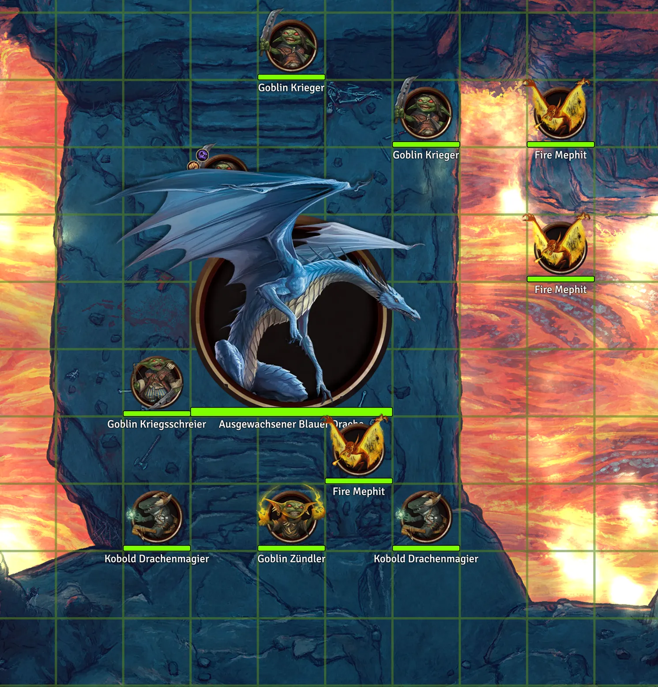
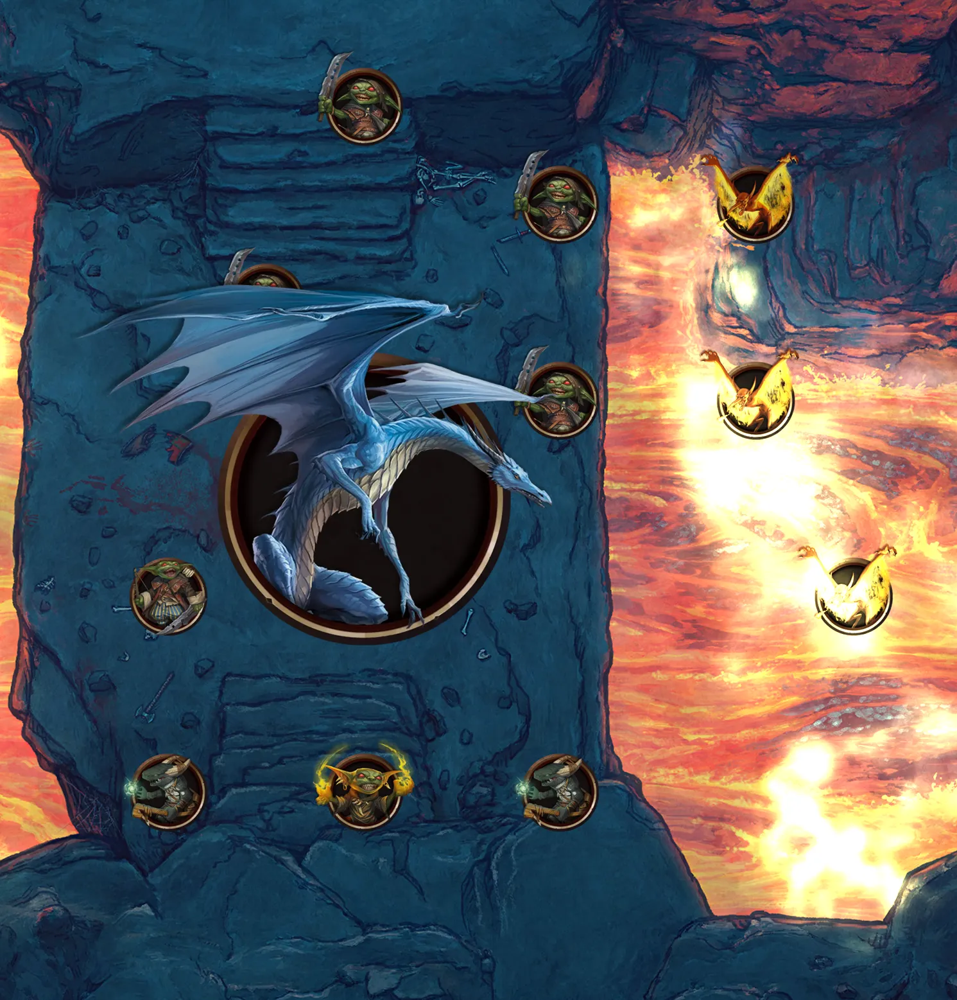
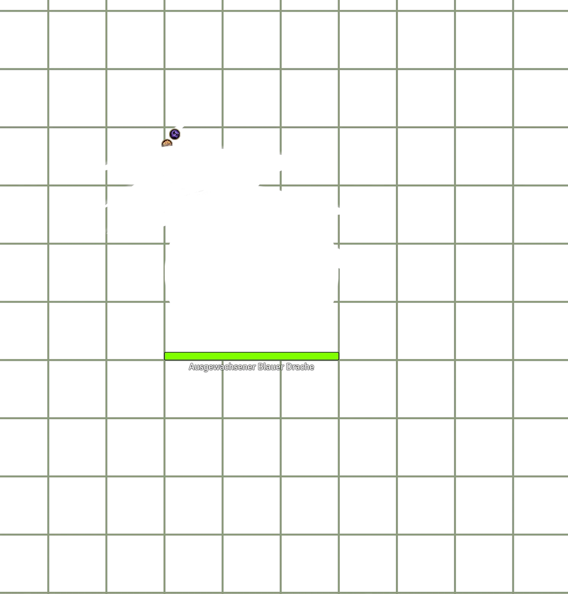

# Unofficial FoundryVTT optimization hacks

Just a collection of hacks to make rendering in Foundry VTT more performant.

Going from\
\
to\
 

## DISCLAIMER

This should be save and has been tested to the best of my ability. BUT foundry might just switch around stuff in future updates that makes these hacks obsolete (which would be the best case) or just breaks the module.

Please use this module on your own risk and if you notice visual glitches (names, ressource bars not working or other token-related stuff) please let me know and jsut disable the module.

This module never saves anything to tokens, so a simple reload with the module disabled should in theroy fix everything :)

## Expected performance gains

The exact value or increase in performance is very difficult to estimate! All it really does is greatly reduce or even elimate the overhead each token has on the performance in a scene. With >20 tokens, each wich certain effect, nameplates visible etc, the improvement might very well be a doubling in framerate. In other very complex scenes with only 4-5 tokens and without token UI elements visible, the performance improvement might not even be noticable.

My observation so far was: Performance improved (soometimes greatly) where needed and was good enough anyway otherwise.

## Settings

This module provides some individual settings to activate certain hacks that aim to improve performance by optimizing the token drawing pipeline in Foundry.

---

**Optimize interface clipping**\
Optimizes how token UI elements are erased by overlapping token images.
Gives the highest performance gains in most scenarios when only few token names or hp bars are shown.

**Cache token nameplates**\
Caches token nameplates to textures, allowing for better batching of the UI elements.

**Cache token ressource bars**\
Caches token ressource bars to textures, allowing for better batching of the UI elements. This can result in slightly blockier hp bars in very high zoom levels.

---

All Settings are considered save and activated by default. If only very few names or ressource bars are shown by default (only on hover for example for every token), the caching of token nameplates and ressource bars can be disabled.

This module is currently expected to be used with Dorako UX's "adjust token effect hud" setting which includes some performance optimizations. A dedicated setting for the default foundry effect textures might come in the future.

## Did you notice any other performance issues in foundry?

Please let me know when you experience performance issues. This whole project started because someone noticed performance issues with the "Adjust token effect HUD" setting of Dorako UX.

For anyone who wants to learn more about the technical details of how foundry renders token and how these measures improve the performance, feel free to read on.

## Observed Performance Issues in Foundry VTT

Foundry VTT has grown quite complex over the years!
Its elevation handling, lighting, the new dynamic token rings etc.
are great and I am still in awe at what Foundry VTT can handle.
Especially the recent V12 update has brought with it numerous
improvements to general canvas performance, elevation and token order handling,
interface layer occlusion and so on.

However, I also think that the performance in scenes, especially with multiple tokens
has somewhat regressed, mainly because of how token occlusion is now handled.

### How Tokens are rendered in Foundry

This is the frame we want to draw:

_Battlemap by [Lone Mapper](https://www.patreon.com/lonemapper)_

All in all, the background and lighting takes about 36 "Draw calls" to complete, while the token UI alone takes 45 more. There is not much we can do about the background drawing, but 45 calls for the UI layer seems exessive. And worse, each token adds 3-5 extra calls! That makes large scenes and battles especially demanding to draw. I'll skip over the nerdy details on how a frame is drawn, but needless to say, there is something we can do to improve it.

  
Wait a minute, show me the nerdy details!

To do something as simple as rendering a token, Foundry uses WebGL and there are quite a few layers to it. Lets focus on the important parts:

First, the background, token icons, darkness layer and more is Drawn. This is actually done very efficiently and only takes 11 draw calls in webgl. Draw calls are essentially the point in a frame where the CPU transfers data to the GPU along with instruction on how to draw it. Then the CPU waits for the GPU to finish and after the frame has been drawn, the programm continues. Each draw call has a fixed overhead and is one of the more expensive operations in drawing in WebGL.

After the initial layers have been drawn, the frame looks like this:

Almost done it seems! Next, lighting layer and effects are drawn and composited with the previous image. This takes another 26 draw calls. Considering 15 animated lights and 57 walls, this is not too bad.
After lighting, the frame looks like this (note the lighting/bloom effects in the lava):

Only the grid and token interface UI (names, hp bars and status effects left)!
Considering every token and the background layer was initially drawn to the canvas in just one call, how long can this take?
It turns out,

8 Calls for the grid, which I don't exactly know why, but then its on to the tokens. And each token in foundry takes about 5 draw calls to complete if nameplates, hp bars and status icons are shown! All in all, just the token UI takes about 45 calls to complete. Lets count the steps for one token:

Preparation: Create a new transparent image to draw everything, then lets look at the poor Kobold in the top left that is behind the dragons wing:

1. Clear the canvas below the token image. Why will become clear very soon. Since switching from painting to clearing breaks batching, this takes one call
1. Paint HP Bars
1. Paint Token Status Effect Background and borders
1. Paint Status Effect Icons
1. Paint Nameplates
   Depending on the situation, some but not all of these calls can be combined, but The clear + 2-3 more calls are common.

Done it looks like this:

Why the canvas is erased becomes clear when the next token, the dragon is drawn: We want to clear the ui behind the dragons wing!

and the complete UI, which is then "just" set atop the background layer.

### The problem

It turns out, the main bottleneck is an erase step in which after a token UI is drawn, parts of it can be erased by an overlapping token. For example, the kobold UI in the top left is almost completely covered by the dragon wing.

But this step is done for every token, brakes batching in the rendering pipeline (switch from paint to erase or back is always a separate step) and most of the UI elements simply arent covered by any tokens!

#### Batching erase calls

The solution in principle is quite simple: Clear the grid in one go, so that the grid does not overlay large tokens for example. Then draw the ui layer and only ever switch to erasing if the token actually covers ui elements!

This simple change means that many erase operations can be done at once and we have to break the batch drawing pipeline only twice. Once for the dragon, once for the mephit near the dragon.

But now we face another problem: Drawing the nameplates and hp bars also break the pipeline since we switch from drawing background graphics for the status icons to drawing the status icon textures (each one a separate texture), to drawing text for the nameplates and again graphics for the hp bar.

#### Texture atlas for status effect icons

To really be able to make the UI draw in one call, we have to elimate these context switches and also reduce the amount of textures for the status icons we have to draw. Reducing the amount of textures is easy. We just write each status effect icon texture once to a large texture in the background and instead of 10 different textures for all the small icons we have one large texture and just draw a slice of it. This way, we only have to upload one texture to the GPU and pass some information on where to draw certain pieces of it.

Even better, we can combine the background and border drawing into this cached texture! This comes with really no downsides in image quality, so a pure win overall.

#### More caching!

Since we already have this spritesheet we create at runtime whenever needed, we can just extend this a little bit to allow for updates and erasures and also cache the nameplates and hp bars. For the nameplates, there is also no perceivable downgrade in image quality, as fonts are always rendered at a fixed maximum resolution, which we just match.
HP Bars on the other hand are vector graphics and caching these means, that on the greates zoom level one might notice a very slight image quality downgrade.

#### the result

After all these steps, what have we gained? With all these optimizations in place and in a scene with only static light sources with many tokens and effects (typcal late-stage encounter), we go from 85 draw calls, 1092 individual webgl commands and
55 max FPS to 36 draw calls, 440 WebGL commands and 100 FPS! Which means theses optimizations save about 8ms per frame!

In more complex scenes the absolute gains in FPS might be lower and also depend very much on the hardware.
